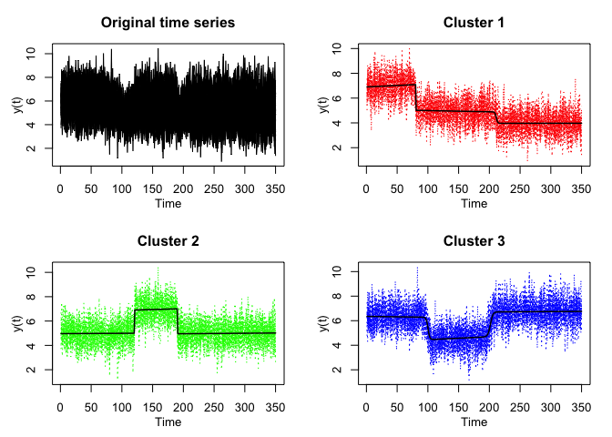
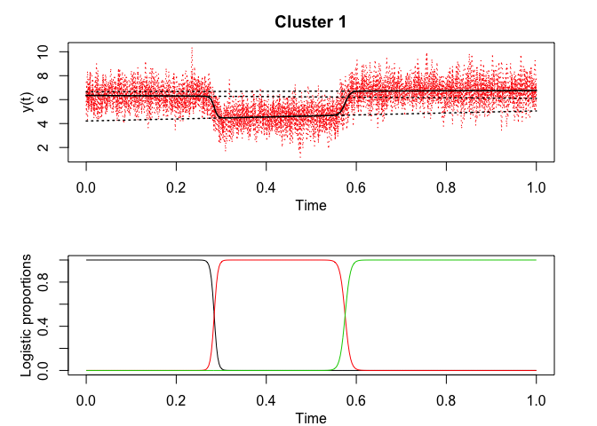
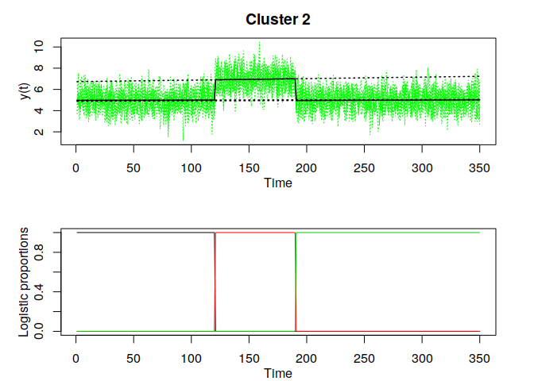
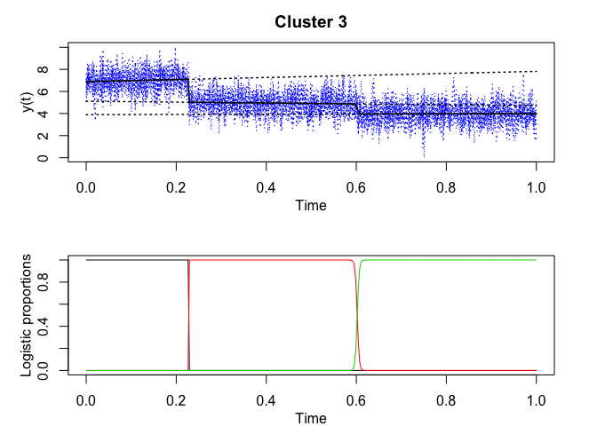
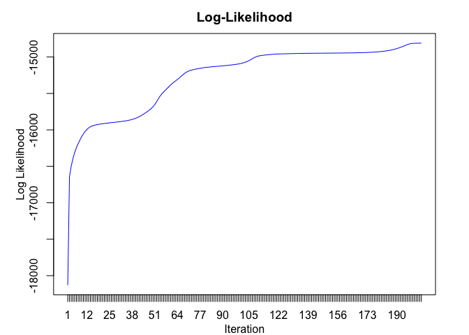

<!-- README.md is generated from README.Rmd. Please edit that file -->

## Overview

<!-- badges: start -->

<!-- badges: end -->

R code for the **clustering** and **segmentation** of time series
(including with regime changes) by mixture of Hidden Logistic Processes
(MixRHLP) and the EM algorithm; i.e functional data clustering and
segmentation.

## Installation

You can install the development version of mixRHLP from
[GitHub](https://github.com/) with:

``` r
# install.packages("devtools")
devtools::install_github("fchamroukhi/mixRHLP")
```

To build *vignettes* for examples of usage, type the command below
instead:

``` r
# install.packages("devtools")
devtools::install_github("fchamroukhi/mixRHLP", 
                         build_opts = c("--no-resave-data", "--no-manual"), 
                         build_vignettes = TRUE)
```

Use the following command to display vignettes:

``` r
browseVignettes("mixRHLP")
```

## Usage

``` r
library(mixRHLP)

data("simulatedtimeseries")

G <- 3 # Number of clusters
K <- 3 # Number of regimes (polynomial regression components)
p <- 1 # Degree of the polynomials
q <- 1 # Order of the logistic regression (by default 1 for contiguous segmentation)
variance_type <- "heteroskedastic" # "heteroskedastic" or "homoskedastic" model

n_tries <- 1
max_iter <- 1000
threshold <- 1e-5
verbose <- TRUE
verbose_IRLS <- FALSE
init_kmeans <- TRUE

mixrhlp <- emMixRHLP(simulatedtimeseries$X, t(as.matrix(simulatedtimeseries[,2:30])), 
                     G, K, p, q, variance_type, n_tries, max_iter, 
                     threshold, verbose, verbose_IRLS, init_kmeans)

mixrhlp$summary()
#> ------------------------
#> Fitted mixRHLP model
#> ------------------------
#> 
#> MixRHLP model with G = 3 clusters and K = 3 regimes:
#> 
#>  log-likelihood nu    AIC       BIC       ICL
#>          -14336 41 -14378 -14406.71 -14406.71
#> 
#> Clustering table:
#>  1  2  3 
#>  9 10 10 
#> 
#> Mixing probabilities (cluster weights):
#>          1         2         3
#>  0.3103448 0.3448276 0.3448276
#> 
#> 
#> --------------------
#> Cluster 1 (G = 1):
#> 
#> Regression coefficients:
#> 
#>     Beta(K = 1) Beta(K = 2) Beta(K = 3)
#> 1     6.9032773   5.0896213 3.965468560
#> X^1   0.8259549  -0.3383998 0.004463925
#> 
#> Variances:
#> 
#>  Sigma2(K = 1) Sigma2(K = 2) Sigma2(K = 3)
#>       1.007093     0.9946919     0.9688277
#> 
#> --------------------
#> Cluster 2 (G = 2):
#> 
#> Regression coefficients:
#> 
#>     Beta(K = 1) Beta(K = 2) Beta(K = 3)
#> 1    4.96556671   6.7326717   4.8807183
#> X^1  0.08880479   0.4984443   0.1350271
#> 
#> Variances:
#> 
#>  Sigma2(K = 1) Sigma2(K = 2) Sigma2(K = 3)
#>      0.9559969       1.03849     0.9506928
#> 
#> --------------------
#> Cluster 3 (G = 3):
#> 
#> Regression coefficients:
#> 
#>     Beta(K = 1) Beta(K = 2) Beta(K = 3)
#> 1     6.3513369    4.214736   6.6536553
#> X^1  -0.2449377    0.839666   0.1024863
#> 
#> Variances:
#> 
#>  Sigma2(K = 1) Sigma2(K = 2) Sigma2(K = 3)
#>      0.9498285     0.9270384      1.001413

mixrhlp$plot()
```


